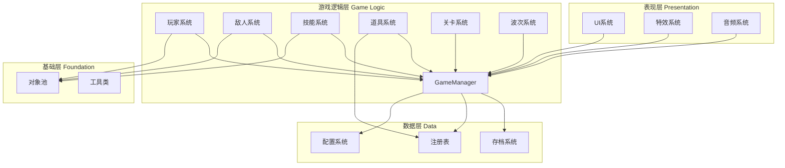
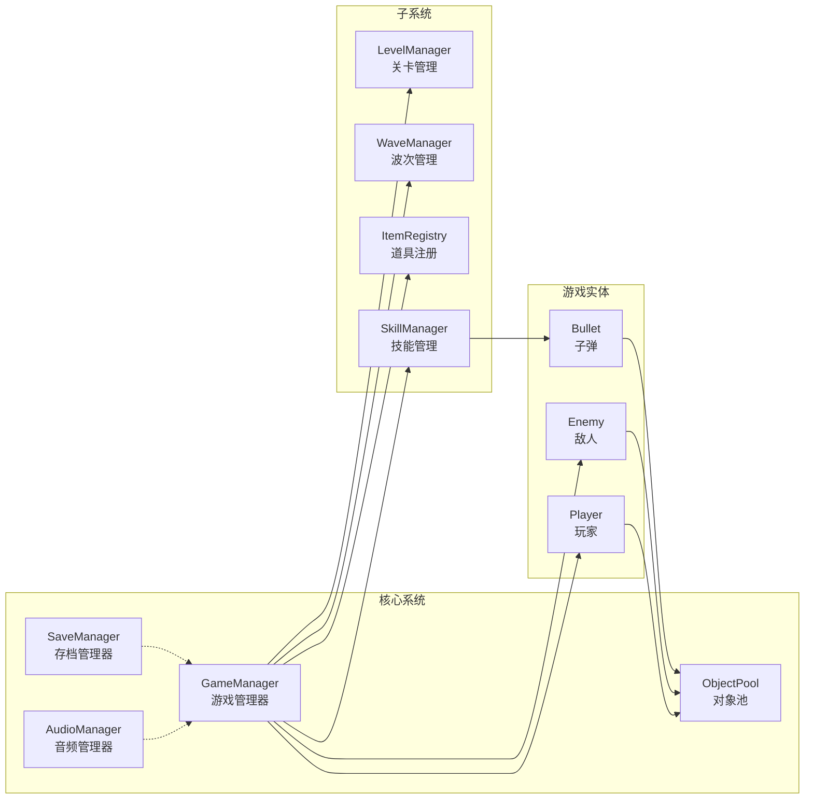
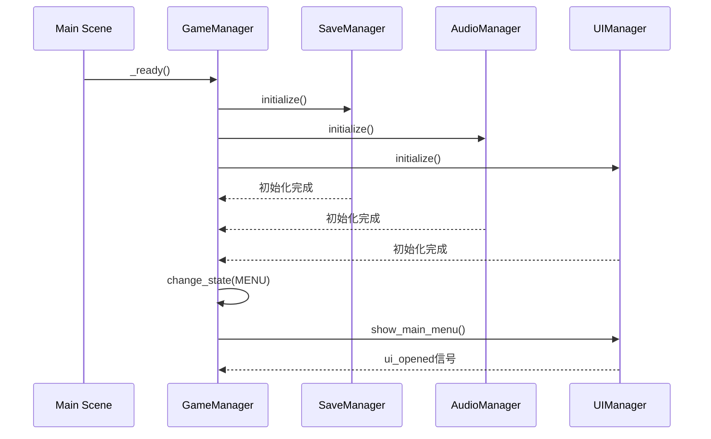
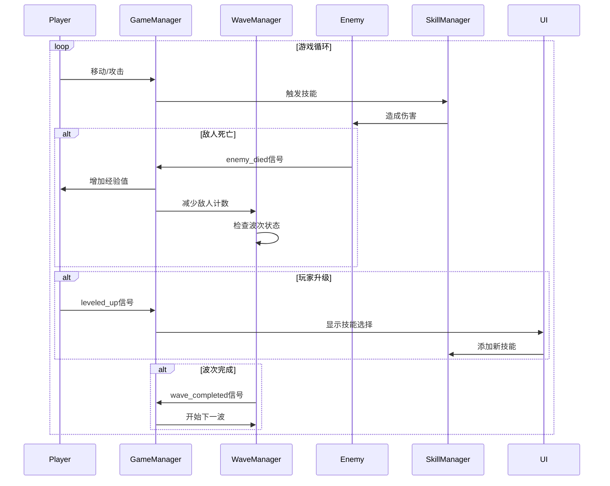
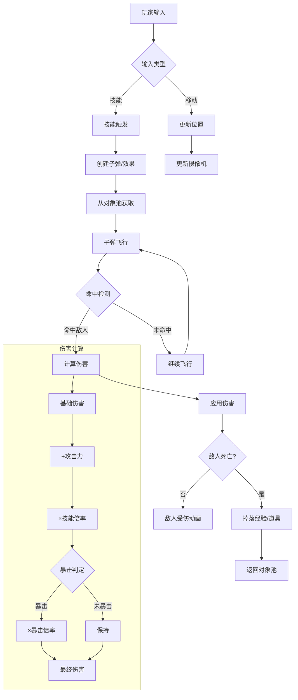
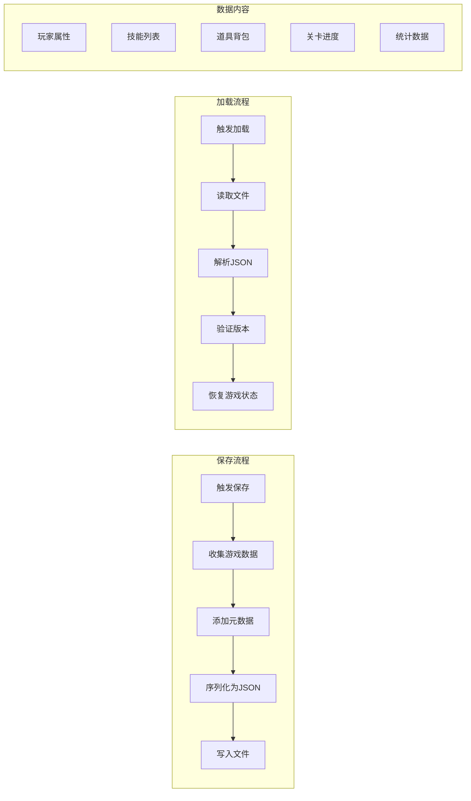
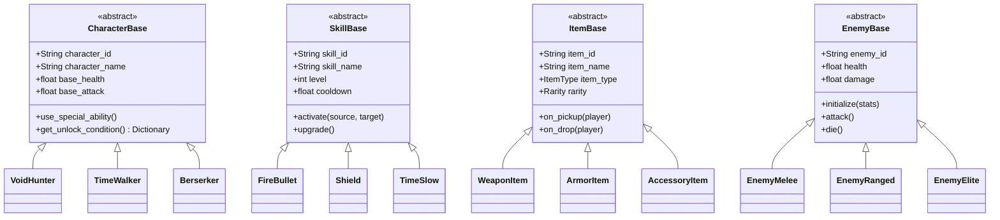
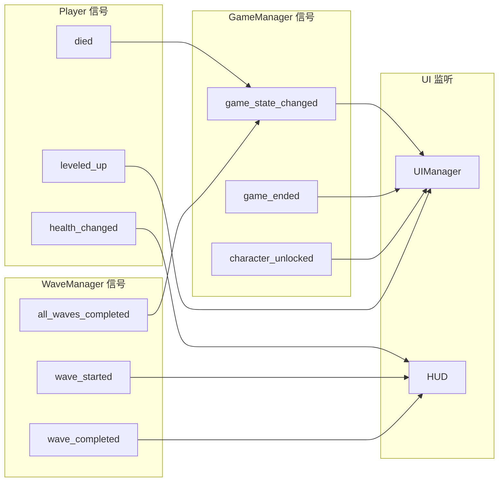

# Void Hunter - 系统架构文档

**版本**: 1.0.0
**作者**: Void Hunter Team
**最后更新**: 2024

---

## 目录

1. [项目结构说明](#1-项目结构说明)
2. [模块划分图](#2-模块划分图)
3. [数据流图](#3-数据流图)
4. [单例服务说明](#4-单例服务说明)
5. [扩展接口说明](#5-扩展接口说明)
6. [技术选型](#6-技术选型)

---

## 1. 项目结构说明

### 1.1 目录结构

```
void_hunter/
├── project.godot              # Godot项目配置文件
├── icon.svg                   # 项目图标
├── README.md                  # 项目说明文档
│
├── assets/                    # 资源文件
│   ├── audio/                 # 音频资源
│   │   ├── bgm/               # 背景音乐
│   │   ├── sfx/               # 音效
│   │   └── ambient/           # 环境音
│   ├── fonts/                 # 字体文件
│   ├── images/                # 图片资源
│   │   ├── characters/        # 角色图片
│   │   ├── enemies/           # 敌人图片
│   │   ├── items/             # 道具图标
│   │   ├── skills/            # 技能图标
│   │   ├── tiles/             # 瓦片素材
│   │   └── ui/                # UI素材
│   └── shaders/               # 着色器
│
├── scenes/                    # 场景文件
│   ├── main.tscn              # 主场景
│   ├── game/                  # 游戏场景
│   │   ├── game.tscn          # 游戏主场景
│   │   └── arena.tscn         # 竞技场场景
│   ├── levels/                # 关卡场景
│   ├── ui/                    # UI场景
│   │   ├── main_menu.tscn     # 主菜单
│   │   ├── hud.tscn           # 游戏HUD
│   │   ├── pause_menu.tscn    # 暂停菜单
│   │   ├── settings_menu.tscn # 设置菜单
│   │   ├── game_over.tscn     # 游戏结束
│   │   ├── character_select.tscn # 角色选择
│   │   └── skill_selection.tscn  # 技能选择
│   ├── characters/            # 角色场景
│   ├── enemies/               # 敌人场景
│   ├── projectiles/           # 弹幕场景
│   └── effects/               # 特效场景
│
├── src/                       # 源代码
│   ├── autoload/              # 自动加载单例
│   │   ├── game_manager.gd    # 游戏管理器
│   │   ├── save_manager.gd    # 存档管理器
│   │   ├── audio_manager.gd   # 音频管理器
│   │   └── object_pool.gd     # 对象池
│   │
│   ├── characters/            # 角色系统
│   │   ├── character_base.gd  # 角色基类
│   │   ├── challenge_system.gd # 挑战系统
│   │   └── characters/        # 具体角色实现
│   │       ├── void_hunter.gd
│   │       ├── time_walker.gd
│   │       ├── berserker.gd
│   │       ├── elemental_mage.gd
│   │       ├── holy_knight.gd
│   │       ├── shadow_assassin.gd
│   │       ├── mechanic.gd
│   │       └── wandering_swordsman.gd
│   │
│   ├── player/                # 玩家系统
│   │   ├── player.gd          # 玩家控制器
│   │   ├── player_stats.gd    # 玩家属性
│   │   └── weapon_component.gd # 武器组件
│   │
│   ├── enemies/               # 敌人系统
│   │   ├── enemy_base.gd      # 敌人基类
│   │   ├── enemy_melee.gd     # 近战敌人
│   │   ├── enemy_ranged.gd    # 远程敌人
│   │   ├── enemy_tank.gd      # 坦克敌人
│   │   ├── enemy_elite.gd     # 精英敌人
│   │   └── ai/                # AI系统
│   │       └── enemy_ai_base.gd
│   │
│   ├── skills/                # 技能系统
│   │   ├── skill_base.gd      # 技能基类
│   │   ├── skill_manager.gd   # 技能管理器
│   │   ├── skill_combinations.gd # 技能组合
│   │   └── skills/            # 具体技能实现
│   │       ├── offensive/     # 进攻型
│   │       ├── defensive/     # 防御型
│   │       ├── control/       # 控制型
│   │       └── support/       # 辅助型
│   │
│   ├── items/                 # 道具系统
│   │   ├── item_base.gd       # 道具基类
│   │   ├── item_registry.gd   # 道具注册表
│   │   ├── item_database.gd   # 道具数据库
│   │   ├── item_codex.gd      # 道具图鉴
│   │   ├── drop_system.gd     # 掉落系统
│   │   └── items/             # 具体道具实现
│   │       ├── weapon_*.gd    # 武器类
│   │       ├── armor_*.gd     # 护甲类
│   │       ├── accessory_*.gd # 饰品类
│   │       ├── consumable_*.gd # 消耗品类
│   │       └── special_*.gd   # 特殊道具类
│   │
│   ├── levels/                # 关卡系统
│   │   ├── level_manager.gd   # 关卡管理器
│   │   ├── level_generator.gd # 关卡生成器
│   │   ├── theme_generator.gd # 主题生成器
│   │   ├── cellular_automata.gd # 元胞自动机
│   │   ├── terrain_noise.gd   # 地形噪声
│   │   ├── dynamic_elements.gd # 动态元素
│   │   ├── scene_transition.gd # 场景过渡
│   │   └── themes/            # 主题配置
│   │       └── level_theme.gd
│   │
│   ├── managers/              # 管理器
│   │   └── wave_manager.gd    # 波次管理器
│   │
│   ├── projectiles/           # 弹幕系统
│   │   ├── bullet_base.gd     # 子弹基类
│   │   ├── bullet_homing.gd   # 追踪弹
│   │   ├── bullet_piercing.gd # 穿透弹
│   │   ├── bullet_bouncing.gd # 弹射弹
│   │   └── bullet_scatter.gd  # 散射弹
│   │
│   ├── ui/                    # UI系统
│   │   ├── ui_manager.gd      # UI管理器
│   │   ├── ui_theme.gd        # UI主题
│   │   ├── main_menu.gd       # 主菜单
│   │   ├── hud.gd             # 游戏HUD
│   │   ├── pause_menu.gd      # 暂停菜单
│   │   ├── settings_menu.gd   # 设置菜单
│   │   ├── game_over.gd       # 游戏结束
│   │   ├── character_select.gd # 角色选择
│   │   ├── skill_selection.gd # 技能选择
│   │   ├── inventory.gd       # 背包界面
│   │   ├── notification_system.gd # 通知系统
│   │   ├── damage_number.gd   # 伤害数字
│   │   ├── virtual_joystick.gd # 虚拟摇杆
│   │   └── virtual_joystick_attack.gd # 攻击摇杆
│   │
│   ├── config/                # 配置
│   │   └── input_mapping_setup.gd # 输入映射配置
│   │
│   └── utils/                 # 工具类
│       └── debug_tools.gd     # 调试工具
│
├── resources/                 # 资源文件
│   ├── characters/            # 角色资源
│   ├── items/                 # 道具资源
│   ├── skills/                # 技能资源
│   └── themes/                # 主题资源
│
└── docs/                      # 文档
    ├── gdd.md                 # 游戏设计文档
    ├── architecture.md        # 系统架构文档
    ├── api_reference.md       # API参考文档
    ├── controls.md            # 操作说明文档
    ├── development_guide.md   # 开发指南
    └── build_guide.md         # 构建指南
```

### 1.2 文件命名规范

| 类型 | 命名规范 | 示例 |
|------|----------|------|
| 场景文件 | snake_case | `main_menu.tscn` |
| 脚本文件 | snake_case | `game_manager.gd` |
| 类名 | PascalCase | `GameManager` |
| 函数名 | snake_case | `get_player_stats()` |
| 变量名 | snake_case | `current_health` |
| 常量 | SCREAMING_SNAKE_CASE | `MAX_HEALTH` |
| 信号 | snake_case | `health_changed` |

---

## 2. 模块划分图

### 2.1 系统架构总览



### 2.2 核心模块关系



### 2.3 模块职责

| 模块 | 职责 | 依赖 |
|------|------|------|
| GameManager | 游戏状态管理、全局事件分发 | SaveManager, AudioManager |
| Player | 玩家控制、属性管理、输入处理 | GameManager, ObjectPool |
| Enemy | 敌人AI、行为管理、生成控制 | GameManager, ObjectPool |
| Skill | 技能效果、冷却管理、组合效果 | Player, Enemy, ObjectPool |
| Item | 道具效果、掉落逻辑、收集管理 | Player, ItemRegistry |
| Level | 关卡生成、主题切换、环境管理 | GameManager, WaveManager |
| Wave | 波次控制、敌人刷新、难度调节 | Enemy, Level |
| UI | 界面显示、用户交互、通知系统 | GameManager |

---

## 3. 数据流图

### 3.1 游戏启动流程



### 3.2 游戏循环数据流



### 3.3 战斗数据流



### 3.4 存档数据流



---

## 4. 单例服务说明

### 4.1 自动加载配置

在 `project.godot` 中配置的自动加载单例：

```ini
[autoload]

GameManager="*res://src/autoload/game_manager.gd"
SaveManager="*res://src/autoload/save_manager.gd"
AudioManager="*res://src/autoload/audio_manager.gd"
ObjectPool="*res://src/autoload/object_pool.gd"
```

### 4.2 GameManager (游戏管理器)

**文件路径**: `src/autoload/game_manager.gd`

**职责**:
- 游戏状态管理（菜单、游戏中、暂停、结束等）
- 全局事件分发
- 游戏统计收集
- 角色解锁管理
- 成就系统协调

**主要属性**:

| 属性 | 类型 | 描述 |
|------|------|------|
| current_state | GameState | 当前游戏状态 |
| selected_character | String | 当前选择的角色ID |
| debug_mode | bool | 是否启用调试模式 |

**主要信号**:

| 信号 | 参数 | 描述 |
|------|------|------|
| game_state_changed | old_state, new_state | 游戏状态变化 |
| game_started | - | 游戏开始 |
| game_paused | - | 游戏暂停 |
| game_resumed | - | 游戏恢复 |
| game_ended | is_victory, stats | 游戏结束 |
| character_unlocked | character_id, character_name | 角色解锁 |
| achievement_unlocked | achievement_id | 成就解锁 |

**使用示例**:

```gdscript
# 获取当前游戏状态
if GameManager.current_state == GameManager.GameState.PLAYING:
    # 游戏进行中的逻辑
    pass

# 监听游戏状态变化
GameManager.game_state_changed.connect(_on_game_state_changed)

# 开始新游戏
GameManager.start_game("void_hunter")

# 暂停游戏
GameManager.pause_game()
```

### 4.3 SaveManager (存档管理器)

**文件路径**: `src/autoload/save_manager.gd`

**职责**:
- 存档的保存、加载、删除
- 自动保存管理
- 游戏设置持久化
- 解锁数据管理

**主要属性**:

| 属性 | 类型 | 描述 |
|------|------|------|
| current_slot | int | 当前存档槽位 |
| auto_save_enabled | bool | 是否启用自动保存 |
| auto_save_interval | float | 自动保存间隔（秒） |

**主要信号**:

| 信号 | 参数 | 描述 |
|------|------|------|
| save_completed | success, slot_id | 保存完成 |
| load_completed | success, slot_id | 加载完成 |
| save_deleted | slot_id | 存档删除 |
| auto_save_completed | success | 自动保存完成 |

**使用示例**:

```gdscript
# 保存游戏
var save_data = {
    "level": 5,
    "experience": 1500,
    "skills": ["fire_bullet", "shield"],
    "items": ["weapon_iron_sword", "armor_cloth"]
}
SaveManager.save_game(save_data, 0)

# 加载游戏
var loaded_data = SaveManager.load_game(0)
if not loaded_data.is_empty():
    # 恢复游戏状态
    pass

# 保存设置
var settings = {
    "audio": {"master_volume": 0.8, "bgm_volume": 0.7},
    "display": {"fullscreen": false}
}
SaveManager.save_settings(settings)
```

### 4.4 AudioManager (音频管理器)

**文件路径**: `src/autoload/audio_manager.gd`

**职责**:
- 背景音乐播放控制
- 音效播放管理
- 音量控制
- 音频总线管理

**主要方法**:

| 方法 | 参数 | 返回值 | 描述 |
|------|------|--------|------|
| play_bgm | stream, fade_time | void | 播放背景音乐 |
| stop_bgm | fade_time | void | 停止背景音乐 |
| play_sfx | stream_path, volume_db | AudioStreamPlayer | 播放音效 |
| set_volume | bus_name, value | void | 设置音量 |

**使用示例**:

```gdscript
# 播放背景音乐
AudioManager.play_bgm(preload("res://assets/audio/bgm/main_theme.ogg"))

# 播放音效
AudioManager.play_sfx("res://assets/audio/sfx/hit.wav")

# 设置音量
AudioManager.set_volume("Master", 0.8)
```

### 4.5 ObjectPool (对象池)

**文件路径**: `src/autoload/object_pool.gd`

**职责**:
- 对象的创建和回收
- 性能优化（减少实例化开销）
- 内存管理

**主要方法**:

| 方法 | 参数 | 返回值 | 描述 |
|------|------|--------|------|
| get_instance | scene, parent | Node | 获取对象实例 |
| return_instance | instance | void | 返回对象到池 |
| warm_up | scene, count | void | 预热对象池 |
| clear_pool | scene | void | 清空指定池 |

**使用示例**:

```gdscript
# 从对象池获取子弹
var bullet = ObjectPool.get_instance(bullet_scene, bullet_container)
bullet.initialize(position, direction, damage)

# 子弹使用完毕后返回池
bullet.on_hit.connect(func():
    ObjectPool.return_instance(bullet)
)

# 预热对象池（在游戏开始时）
ObjectPool.warm_up(bullet_scene, 50)
```

---

## 5. 扩展接口说明

### 5.1 角色扩展接口

要添加新角色，需要继承 `CharacterBase` 类：

```gdscript
# src/characters/characters/new_character.gd
extends CharacterBase
class_name NewCharacter

# 角色配置
func _init():
    character_id = "new_character"
    character_name = "新角色"
    description = "角色描述"
    
    # 基础属性
    base_health = 120.0
    base_mana = 60.0
    base_attack = 15.0
    base_defense = 8.0
    base_speed = 160.0

# 特殊能力
func use_special_ability() -> void:
    # 实现特殊能力逻辑
    pass

# 被动效果
func _process(delta: float) -> void:
    super._process(delta)
    # 角色特有的被动效果
```

**必须实现的接口**:

| 方法 | 描述 |
|------|------|
| _init() | 初始化角色配置 |
| get_unlock_condition() -> Dictionary | 返回解锁条件 |

### 5.2 技能扩展接口

要添加新技能，需要继承 `SkillBase` 类：

```gdscript
# src/skills/skills/offensive/new_skill.gd
extends SkillBase
class_name NewSkill

func _init():
    skill_id = "new_skill"
    skill_name = "新技能"
    description = "技能描述"
    skill_type = SkillType.OFFENSIVE
    max_level = 5
    cooldown = 2.0
    mana_cost = 20.0

# 技能激活时调用
func activate(source: Node, target: Node = null) -> void:
    super.activate(source, target)
    # 实现技能效果

# 技能升级效果
func _apply_level_effects() -> void:
    match level:
        2:
            damage *= 1.2
        3:
            cooldown *= 0.9
        4:
            damage *= 1.3
        5:
            # 觉醒效果
            damage *= 1.5
```

**必须实现的接口**:

| 方法 | 描述 |
|------|------|
| _init() | 初始化技能配置 |
| activate(source, target) | 技能激活逻辑 |
| get_description() -> String | 返回技能描述（含当前等级效果） |

### 5.3 道具扩展接口

要添加新道具，需要继承 `ItemBase` 类：

```gdscript
# src/items/items/new_item.gd
extends ItemBase
class_name NewItem

func _init():
    item_id = "new_item"
    item_name = "新道具"
    description = "道具描述"
    item_type = ItemType.ACCESSORY
    rarity = Rarity.RARE
    
    # 道具效果
    effects = {
        "attack_percent": 0.15,
        "critical_chance": 0.05
    }

# 道具拾取时调用
func on_pickup(player: Node) -> void:
    super.on_pickup(player)
    # 应用道具效果

# 道具丢弃时调用
func on_drop(player: Node) -> void:
    super.on_drop(player)
    # 移除道具效果

# 被动效果（每帧调用）
func on_update(player: Node, delta: float) -> void:
    # 实现被动效果
    pass
```

**必须实现的接口**:

| 方法 | 描述 |
|------|------|
| _init() | 初始化道具配置 |
| on_pickup(player) | 拾取时效果 |
| on_drop(player) | 丢弃时效果 |

### 5.4 敌人扩展接口

要添加新敌人，需要继承 `EnemyBase` 类：

```gdscript
# src/enemies/new_enemy.gd
extends EnemyBase
class_name NewEnemy

func _init():
    enemy_id = "new_enemy"
    enemy_name = "新敌人"
    enemy_type = EnemyType.MELEE
    
    # 基础属性
    base_health = 50.0
    base_damage = 10.0
    base_speed = 80.0
    experience_value = 20

# 初始化敌人
func initialize(stats: Dictionary = {}) -> void:
    super.initialize(stats)
    # 额外初始化逻辑

# 攻击行为
func attack() -> void:
    # 实现攻击逻辑
    pass

# 死亡处理
func die() -> void:
    super.die()
    # 额外死亡逻辑（如掉落特殊道具）
```

**必须实现的接口**:

| 方法 | 描述 |
|------|------|
| _init() | 初始化敌人配置 |
| initialize(stats) | 初始化敌人实例 |
| attack() | 攻击行为 |
| die() | 死亡处理 |

### 5.5 关卡主题扩展接口

要添加新关卡主题，需要创建 `LevelTheme` 资源：

```gdscript
# 在编辑器中创建 LevelTheme 资源
# 或通过代码创建

var new_theme = LevelTheme.new()
new_theme.theme_id = "ocean"
new_theme.theme_name = "深海"
new_theme.environment_type = LevelTheme.EnvironmentType.VOID
new_theme.background_color = Color(0.0, 0.1, 0.2)
new_theme.ambient_light_color = Color(0.2, 0.3, 0.5)
new_theme.base_difficulty = 1.2
new_theme.min_level = 8
new_theme.max_level = 12

# 配置敌人池
new_theme.enemy_pool = [
    preload("res://scenes/enemies/fish_enemy.tscn"),
    preload("res://scenes/enemies/jellyfish_enemy.tscn")
]

# 配置Boss池
new_theme.boss_pool = [
    preload("res://scenes/enemies/kraken_boss.tscn")
]
```

---

## 6. 技术选型

### 6.1 引擎版本

- **Godot Engine**: 4.x
- **渲染器**: Forward+ (PC) / Mobile (移动端)

### 6.2 编程语言

- **主要语言**: GDScript
- **性能关键代码**: 可选用 C# (GodotSharp)

### 6.3 第三方依赖

当前项目无外部依赖，仅使用Godot内置功能。

### 6.4 目标平台

| 平台 | 渲染器 | 输入方式 |
|------|--------|----------|
| Windows | Forward+ | 键盘+鼠标 |
| macOS | Forward+ | 键盘+鼠标 |
| Linux | Forward+ | 键盘+鼠标 |
| WebGL | Forward+ | 键盘+鼠标+触摸 |
| Android | Mobile | 触摸 |

### 6.5 性能目标

| 指标 | 目标值 |
|------|--------|
| 帧率 | 60 FPS (移动端30 FPS) |
| 内存占用 | < 500MB |
| 启动时间 | < 5秒 |
| 场景加载 | < 2秒 |

---

## 附录

### A. 类图



### B. 信号连接图


