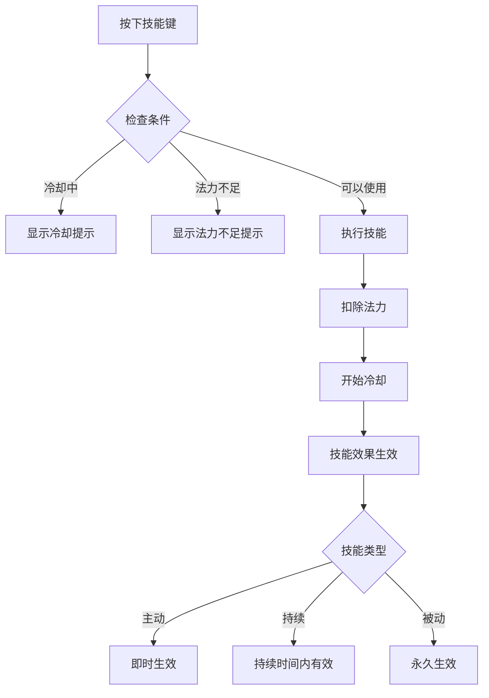

# Void Hunter - 操作说明文档

**版本**: 1.0.0
**作者**: Void Hunter Team
**最后更新**: 2024

---

## 目录

1. [PC端控制](#1-pc端控制)
2. [移动端控制](#2-移动端控制)
3. [技能快捷键](#3-技能快捷键)
4. [系统菜单操作](#4-系统菜单操作)
5. [游戏内快捷操作](#5-游戏内快捷操作)

---

## 1. PC端控制

### 1.1 移动控制

| 按键 | 功能 | 描述 |
|------|------|------|
| `W` / `↑` | 向上移动 | 按住持续向上 |
| `S` / `↓` | 向下移动 | 按住持续向下 |
| `A` / `←` | 向左移动 | 按住持续向左 |
| `D` / `→` | 向右移动 | 按住持续向右 |
| `Shift` | 冲刺 | 消耗体力快速移动 |
| `Space` | 闪避 | 无敌帧闪避（部分角色） |

### 1.2 攻击控制

游戏采用自动攻击机制，角色会自动向最近的敌人发射武器。

| 操作 | 功能 | 描述 |
|------|------|------|
| 自动 | 普通攻击 | 角色自动攻击范围内敌人 |
| 鼠标移动 | 瞄准方向 | 影响自动攻击的优先方向 |

### 1.3 技能控制

| 按键 | 功能 | 描述 |
|------|------|------|
| `1` - `4` | 主动技能 | 使用对应的主动技能 |
| `Q` | 特殊能力 | 使用角色特殊能力 |
| `E` | 互动 | 与场景物品互动 |
| `R` | 大招 | 使用终极技能（需要充能） |

### 1.4 界面控制

| 按键 | 功能 | 描述 |
|------|------|------|
| `Tab` | 道具栏 | 打开/关闭道具栏界面 |
| `I` | 角色信息 | 打开/关闭角色属性面板 |
| `C` | 技能面板 | 打开/关闭已学技能列表 |
| `Esc` | 暂停菜单 | 打开暂停菜单 |
| `F1` | 帮助 | 显示操作帮助 |
| `F3` | 调试信息 | 显示/隐藏调试信息（调试模式） |

### 1.5 完整键位表

```
                    ┌─────────────────────────────────┐
                    │          PC 控制布局            │
                    └─────────────────────────────────┘

     ┌─────┐                                            ┌─────┐
     │ Esc │ 暂停                                       │ F1  │ 帮助
     └─────┘                                            └─────┘

     ┌─────┬─────┬─────┬─────┐     ┌─────────────────────┐
     │  1  │  2  │  3  │  4  │     │      Tab 道具栏      │
     │技能1│技能2│技能3│技能4│     └─────────────────────┘
     └─────┴─────┴─────┴─────┘
                                                          
     ┌─────┬─────┬─────┬─────┬─────┬─────┐               
     │  Q  │  W  │  E  │  R  │  T  │  Y  │               
     │特殊 │ ↑  │互动 │大招 │     │     │               
     ├─────┼─────┼─────┼─────┼─────┼─────┤               
     │  A  │  S  │  D  │  F  │  G  │  H  │               
     │ ←  │ ↓  │ →  │     │     │     │               
     ├─────┼─────┼─────┼─────┼─────┼─────┤               
     │  Z  │  X  │  C  │  V  │  B  │  N  │               
     │     │     │技能 │     │     │     │               
     └─────┴─────┴─────┴─────┴─────┴─────┘               
                                                          
                    ┌───────────┐
                    │  Space    │
                    │   闪避    │
                    ├───────────┤
                    │  Shift    │
                    │   冲刺    │
                    └───────────┘
```

---

## 2. 移动端控制

### 2.1 触摸控制概述

移动端使用虚拟摇杆进行控制，界面布局针对触摸操作进行了优化。

### 2.2 移动摇杆

**位置**: 屏幕左下角

| 操作 | 功能 |
|------|------|
| 拖动摇杆 | 控制角色移动方向 |
| 释放摇杆 | 摇杆自动回中，角色停止移动 |
| 快速滑动 | 触发闪避（需要体力） |

### 2.3 攻击摇杆

**位置**: 屏幕右下角

| 操作 | 功能 |
|------|------|
| 拖动摇杆 | 控制攻击方向（覆盖自动瞄准） |
| 释放摇杆 | 恢复自动瞄准 |
| 双击 | 使用特殊能力 |

### 2.4 技能按钮

**位置**: 屏幕右侧中部

| 按钮 | 功能 |
|------|------|
| 技能1 | 使用主动技能1 |
| 技能2 | 使用主动技能2 |
| 技能3 | 使用主动技能3 |
| 技能4 | 使用主动技能4 |
| 大招按钮 | 使用终极技能（发光时可用） |

### 2.5 界面布局

```
┌─────────────────────────────────────────────────────────┐
│  [≡]                                                     │
│                                                          │
│     ┌──────────────────────────────────────────────┐    │
│     │                                              │    │
│     │                                              │    │
│     │              游戏画面区域                     │    │
│     │                                              │    │
│     │                                              │    │
│     │                                              │    │
│     │         [大招按钮]                            │    │
│     │                                              │    │
│     │    [技1] [技2] [技3] [技4]                   │    │
│     └──────────────────────────────────────────────┘    │
│                                                          │
│  ┌──────┐                              ┌──────┐         │
│  │  ○   │                              │  ○   │         │
│  │ ╲ ╱  │                              │ ╲ ╱  │         │
│  │  ●   │ 移动摇杆                      │  ●   │ 攻击摇杆│
│  └──────┘                              └──────┘         │
│                                                          │
└─────────────────────────────────────────────────────────┘
```

### 2.6 手势操作

| 手势 | 功能 | 使用场景 |
|------|------|----------|
| 双指捏合 | 缩放地图 | 查看更大范围 |
| 双指滑动 | 平移视角 | 查看周围环境 |
| 三指点击 | 暂停游戏 | 快速暂停 |
| 长按技能 | 查看技能说明 | 技能信息查看 |

### 2.7 触摸反馈

| 反馈类型 | 描述 |
|----------|------|
| 震动 | 技能释放、受到伤害时震动反馈 |
| 音效 | 按钮点击音效 |
| 视觉 | 按钮按下效果、技能冷却动画 |

---

## 3. 技能快捷键

### 3.1 PC端技能绑定

| 快捷键 | 技能类型 | 描述 |
|--------|----------|------|
| `1` | 进攻技能1 | 第一个进攻型技能 |
| `2` | 进攻技能2 | 第二个进攻型技能 |
| `3` | 防御技能 | 防御型技能 |
| `4` | 控制/辅助技能 | 控制或辅助型技能 |
| `Q` | 角色特殊能力 | 角色专属技能 |
| `R` | 终极技能 | 需要充能的强力技能 |

### 3.2 技能使用流程



### 3.3 技能冷却显示

**PC端**:
- 技能图标上显示冷却倒计时数字
- 冷却期间图标变暗
- 就绪时图标闪烁提示

**移动端**:
- 技能按钮外圈显示冷却进度
- 冷却完成时按钮发光

### 3.4 技能组合快捷键

部分技能组合需要同时按下：

| 组合 | 快捷键 | 效果 |
|------|--------|------|
| 元素风暴 | `1` + `2` (0.5秒内) | 火焰+闪电组合技 |
| 绝对防御 | `3` + `Shift` | 防御+闪避组合 |

---

## 4. 系统菜单操作

### 4.1 主菜单

| 选项 | 操作 | 描述 |
|------|------|------|
| 开始游戏 | 点击/回车 | 进入角色选择 |
| 继续游戏 | 点击/回车 | 加载最近存档 |
| 设置 | 点击/回车 | 打开设置菜单 |
| 图鉴 | 点击/回车 | 查看道具/角色图鉴 |
| 退出 | 点击/回车 | 退出游戏 |

**键盘导航**:
- `↑` `↓`: 选择菜单项
- `Enter`: 确认选择
- `Esc`: 返回上一级

### 4.2 角色选择

| 操作 | 功能 |
|------|------|
| `←` `→` / 点击 | 切换角色 |
| `Enter` / 双击 | 确认选择 |
| `I` / 长按 | 查看角色详情 |
| `Esc` / 返回按钮 | 返回主菜单 |

**角色信息显示**:
- 角色立绘和名称
- 基础属性值
- 特殊能力描述
- 解锁条件（未解锁时）

### 4.3 暂停菜单

| 选项 | 快捷键 | 描述 |
|------|--------|------|
| 继续 | `Esc` / 点击 | 继续游戏 |
| 设置 | 点击 | 打开设置 |
| 道具栏 | `Tab` | 查看已获得道具 |
| 技能 | `C` | 查看已学技能 |
| 返回主菜单 | 点击 | 放弃当前进度返回 |

### 4.4 设置菜单

#### 4.4.1 音频设置

| 设置项 | 范围 | 默认值 |
|--------|------|--------|
| 主音量 | 0% - 100% | 80% |
| 背景音乐 | 0% - 100% | 70% |
| 音效 | 0% - 100% | 100% |
| 环境音 | 0% - 100% | 50% |

#### 4.4.2 画面设置

| 设置项 | 选项 | 默认值 |
|--------|------|--------|
| 分辨率 | 1920x1080, 1600x900, 1280x720 | 1920x1080 |
| 全屏模式 | 全屏/窗口化/无边框 | 窗口化 |
| 垂直同步 | 开/关 | 开 |
| 画质 | 高/中/低 | 高 |
| 帧率限制 | 30/60/120/无限制 | 60 |

#### 4.4.3 游戏设置

| 设置项 | 选项 | 默认值 |
|--------|------|--------|
| 自动攻击 | 开/关 | 开 |
| 伤害数字显示 | 开/关 | 开 |
| 震动反馈 | 开/关 | 开 |
| 敌人血条显示 | 开/关 | 开 |

#### 4.4.4 控制设置

- 重新绑定键盘按键
- 调整摇杆灵敏度
- 调整摇杆大小（移动端）
- 反转Y轴（如适用）

### 4.5 技能选择界面

每级升级时弹出：

| 操作 | 功能 |
|------|------|
| `1` `2` `3` / 点击 | 选择对应技能 |
| `I` / 长按 | 查看技能详情 |
| `Tab` | 切换技能类别 |

---

## 5. 游戏内快捷操作

### 5.1 HUD界面说明

```
┌─────────────────────────────────────────────────────────┐
│ [等级: 5]          [波次: 3/10]          [敌人: 45]     │
│                                                          │
│ ┌─────────────────────────────────────────────────────┐ │
│ │                                                     │ │
│ │                    游戏画面                          │ │
│ │                                                     │ │
│ │                                                     │ │
│ │                                                     │ │
│ └─────────────────────────────────────────────────────┘ │
│                                                          │
│ ┌──────────────────┐    ┌─────────────────────────────┐ │
│ │ ❤️ HP  ████████░░│    │ [技1] [技2] [技3] [技4]    │ │
│ │ 💙 MP  ██████████│    │ [Q]   [R]                  │ │
│ │ 💚 ST ██████░░░░░│    └─────────────────────────────┘ │
│ │ ⭐ XP  ████░░░░░░│                                    │
│ └──────────────────┘    ┌─────────────────────────────┐ │
│                          │ [道具1] [道具2] [道具3]    │ │
│                          │ [道具4] [道具5] [道具6]    │ │
│                          └─────────────────────────────┘ │
└─────────────────────────────────────────────────────────┘
```

### 5.2 状态栏说明

| 图标 | 属性 | 描述 |
|------|------|------|
| ❤️ | 生命值 (HP) | 降为0时角色死亡 |
| 💙 | 法力值 (MP) | 释放技能消耗 |
| 💚 | 体力值 (Stamina) | 冲刺和闪避消耗 |
| ⭐ | 经验值 (XP) | 满后升级 |

### 5.3 快速操作

| 操作 | 快捷键 | 描述 |
|------|--------|------|
| 使用消耗品 | `F1` - `F4` | 使用对应槽位消耗品 |
| 快速存档 | `F5` | 快速保存 |
| 快速读档 | `F9` | 快速加载 |
| 截图 | `F12` | 保存截图 |

### 5.4 战斗提示

#### 5.4.1 伤害数字

| 颜色 | 含义 |
|------|------|
| 白色 | 普通伤害 |
| 黄色 | 暴击伤害 |
| 红色 | 受到伤害 |
| 绿色 | 治疗量 |
| 蓝色 | 经验值获得 |

#### 5.4.2 敌人标记

| 标记 | 含义 |
|------|------|
| 红色血条 | 普通敌人 |
| 黄色血条 | 精英敌人 |
| 紫色血条 | Boss |
| 骷髅图标 | 即将死亡的敌人 |

### 5.5 小地图

| 功能 | 操作 |
|------|------|
| 放大 | 鼠标滚轮上滚 / 双指展开 |
| 缩小 | 鼠标滚轮下滚 / 双指捏合 |
| 平移 | 右键拖动 / 双指滑动 |
| 重置 | 点击小地图中心 |

### 5.6 通知系统

游戏内通知会显示在屏幕上方：

| 通知类型 | 图标颜色 | 示例 |
|----------|----------|------|
| 成就解锁 | 金色 | "成就解锁：初次击杀" |
| 角色解锁 | 紫色 | "解锁角色：暗影刺客" |
| 道具获得 | 蓝色 | "获得：稀有武器" |
| 升级 | 绿色 | "等级提升！Lv.5" |
| 警告 | 红色 | "Boss即将出现！" |

---

## 附录

### A. 输入映射配置

可在 `res://src/config/input_mapping_setup.gd` 中查看和修改默认输入映射：

```gdscript
# 移动输入
"move_up": [KEY_W, KEY_UP]
"move_down": [KEY_S, KEY_DOWN]
"move_left": [KEY_A, KEY_LEFT]
"move_right": [KEY_D, KEY_RIGHT]

# 技能输入
"skill_1": [KEY_1]
"skill_2": [KEY_2]
"skill_3": [KEY_3]
"skill_4": [KEY_4]
"special_ability": [KEY_Q]
"ultimate": [KEY_R]

# 系统输入
"pause": [KEY_ESCAPE]
"inventory": [KEY_TAB]
"interact": [KEY_E]
```

### B. 手柄支持

游戏支持常见游戏手柄：

| 手柄按键 | 功能 |
|----------|------|
| 左摇杆 | 移动 |
| 右摇杆 | 瞄准/攻击方向 |
| A/X | 确认/闪避 |
| B/O | 取消 |
| X/□ | 技能1 |
| Y/△ | 技能2 |
| LB/L1 | 技能3 |
| RB/R1 | 技能4 |
| LT/L2 | 特殊能力 |
| RT/R2 | 大招 |
| Start | 暂停 |
| Select | 道具栏 |

### C. 常见问题

**Q: 按键没有反应？**
A: 检查设置中的按键绑定，确保没有冲突。

**Q: 移动摇杆不灵敏？**
A: 在设置中调整摇杆灵敏度。

**Q: 技能无法使用？**
A: 检查法力值是否足够，技能是否在冷却中。

**Q: 如何重新绑定按键？**
A: 进入设置 -> 控制 -> 按键绑定，点击要修改的按键后按下新按键。
