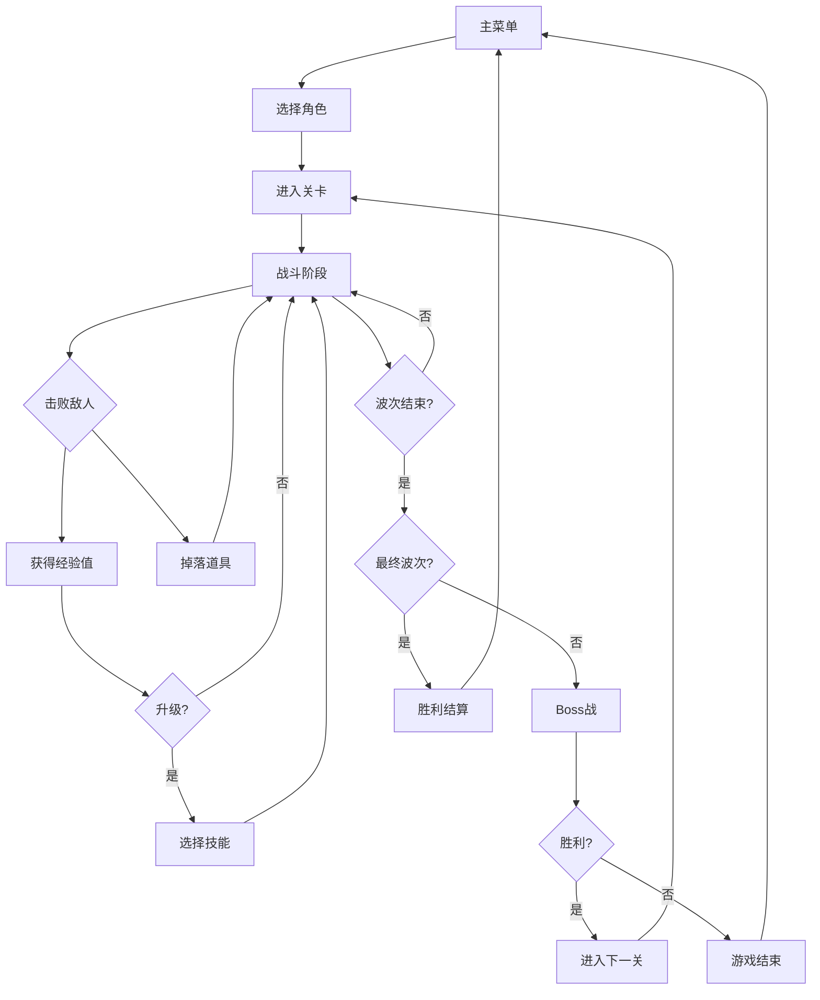
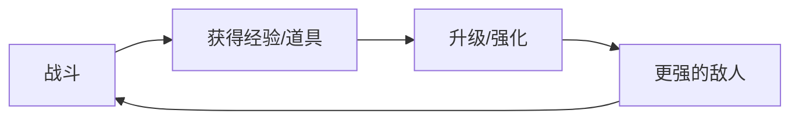
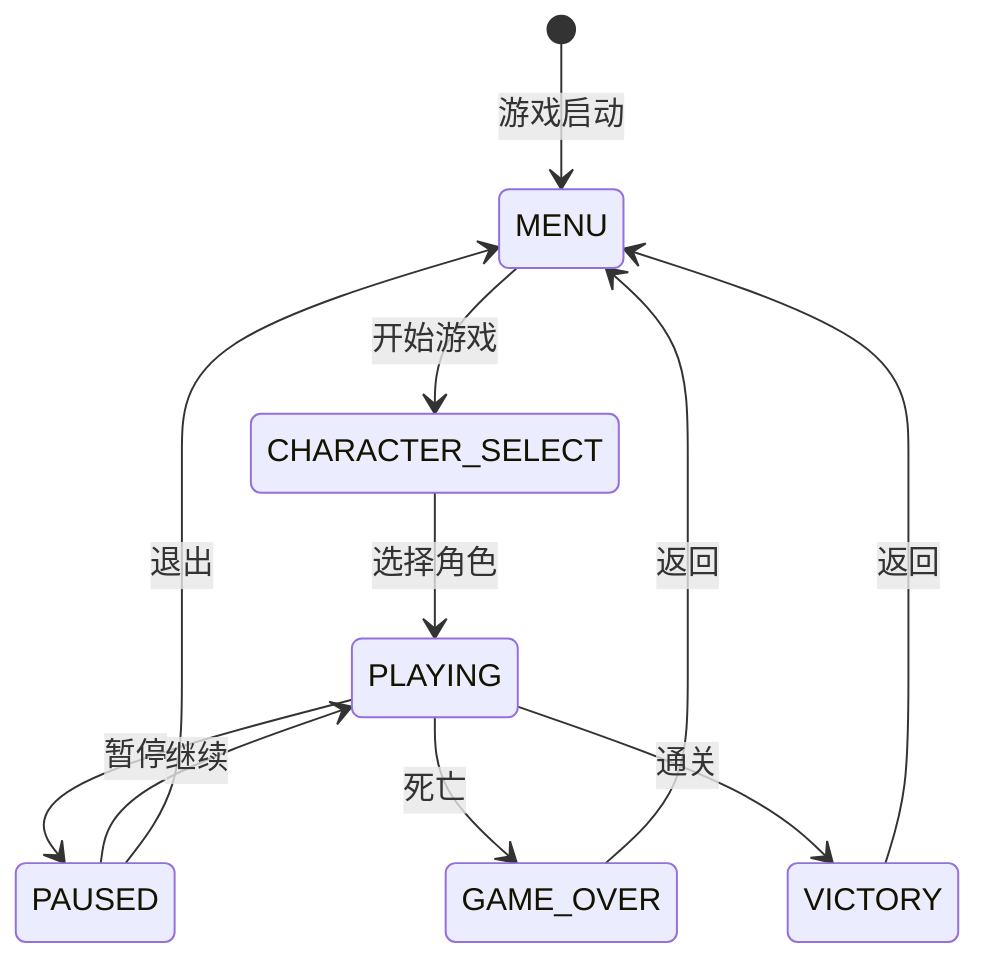
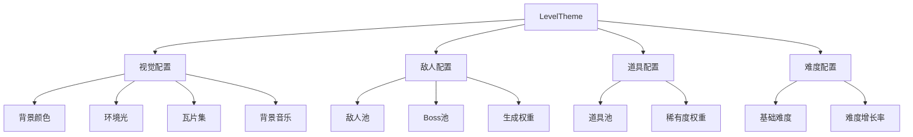
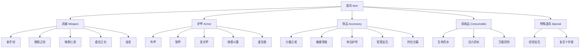
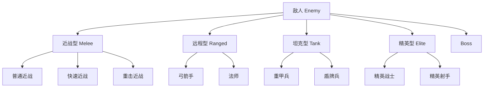
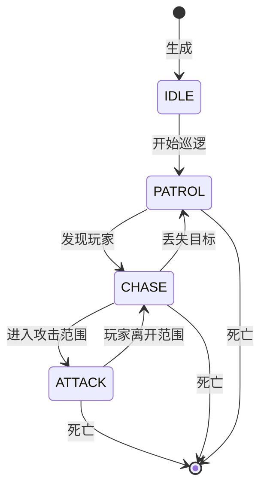

# Void Hunter - 游戏设计文档 (GDD)

**版本**: 1.0.0
**作者**: Void Hunter Team
**最后更新**: 2024

---

## 目录

1. [游戏概述](#1-游戏概述)
2. [核心玩法循环](#2-核心玩法循环)
3. [系统设计](#3-系统设计)
4. [数值平衡](#4-数值平衡)
5. [目标用户分析](#5-目标用户分析)
6. [未来规划](#6-未来规划)

---

## 1. 游戏概述

### 1.1 游戏概念

**Void Hunter（虚空猎人）** 是一款Roguelike Survivor类型的动作游戏。玩家扮演各种独特的角色，在随机生成的关卡中对抗源源不断的敌人，通过升级获取技能，收集道具，挑战强大的Boss，最终目标是击败所有波次的敌人并生存下来。

### 1.2 核心特色

- **多样化角色系统**: 8个独特角色，每个都有专属技能和玩法风格
- **丰富的技能系统**: 20+技能，支持技能组合和进化
- **道具收集系统**: 40+道具，包括武器、护甲、饰品和消耗品
- **程序化关卡生成**: 每局游戏都有独特的地图布局
- **多主题环境**: 地牢、森林、沙漠、冰雪、火山、虚空、城堡等主题
- **跨平台支持**: PC（键盘+鼠标）和移动端（触摸控制）

### 1.3 游戏类型

| 属性 | 描述 |
|------|------|
| 类型 | Roguelike / Survivor / Action |
| 视角 | 俯视视角 (Top-down) |
| 人数 | 单人 |
| 平台 | PC (Windows/Mac/Linux), WebGL, Android |
| 引擎 | Godot 4.x |

### 1.4 游戏流程概览



---

## 2. 核心玩法循环

### 2.1 主循环

游戏的核心循环遵循 "战斗 → 成长 → 挑战" 的模式：



### 2.2 详细流程

#### 2.2.1 游戏开始
1. 玩家从主菜单选择开始游戏
2. 进入角色选择界面，选择一个已解锁的角色
3. 游戏加载关卡，生成地图布局
4. 玩家出现在地图中央

#### 2.2.2 战斗阶段
1. **自动攻击**: 角色自动发射武器攻击最近敌人
2. **移动控制**: 玩家控制角色移动躲避敌人攻击
3. **技能释放**: 主动/被动技能自动触发
4. **击杀敌人**: 获得经验值和道具掉落

#### 2.2.3 成长阶段
1. **升级**: 经验值满后升级，弹出技能选择界面
2. **技能选择**: 从3个随机技能中选择一个
3. **道具收集**: 拾取掉落的道具获得永久/临时增益

#### 2.2.4 波次推进
1. 每个关卡包含多个波次
2. 每波敌人数量和强度递增
3. 最终波次出现Boss
4. 击败Boss进入下一关卡或结束游戏

### 2.3 游戏状态



---

## 3. 系统设计

### 3.1 关卡系统

#### 3.1.1 关卡结构

| 关卡 | 主题 | 波次数 | Boss | 解锁条件 |
|------|------|--------|------|----------|
| 1 | 地牢 | 5 | 骷髅王 | 默认 |
| 2 | 森林 | 7 | 森林守护者 | 通关关卡1 |
| 3 | 沙漠 | 8 | 沙虫 | 通关关卡2 |
| 4 | 冰雪 | 9 | 冰霜巨人 | 通关关卡3 |
| 5 | 火山 | 10 | 炎魔 | 通关关卡4 |
| 6 | 城堡 | 12 | 黑暗骑士 | 通关关卡5 |
| 7 | 虚空 | 15 | 虚空领主 | 通关关卡6 |

#### 3.1.2 主题环境



#### 3.1.3 地图生成

游戏使用程序化生成技术创建关卡地图：

- **元胞自动机 (Cellular Automata)**: 生成基础地形
- **柏林噪声 (Perlin Noise)**: 添加自然细节
- **动态元素系统**: 放置障碍物、宝箱、传送点等

### 3.2 技能系统

#### 3.2.1 技能类型

| 类型 | 描述 | 触发方式 |
|------|------|----------|
| 进攻型 | 造成伤害的技能 | 自动/主动 |
| 防御型 | 提供保护的技能 | 被动/触发 |
| 控制型 | 限制敌人的技能 | 自动/主动 |
| 辅助型 | 增益自身的技能 | 被动 |

#### 3.2.2 技能列表

**进攻型技能**:
- 火焰弹 (Fire Bullet) - 发射火焰弹幕
- 霜冻箭 (Frost Arrow) - 减速敌人
- 闪电链 (Lightning Chain) - 链式闪电
- 暗影斩 (Shadow Slash) - 近战范围攻击

**防御型技能**:
- 护盾 (Shield) - 临时无敌
- 闪现 (Blink) - 瞬间移动
- 铁壁 (Iron Wall) - 减伤效果
- 反射 (Reflect) - 反弹伤害

**控制型技能**:
- 重力场 (Gravity Field) - 吸引敌人
- 时间减速 (Time Slow) - 减缓敌人移动

**辅助型技能**:
- 治疗光环 (Healing Aura) - 持续恢复生命
- 速度光环 (Speed Aura) - 提升移动速度

#### 3.2.3 技能进化


技能达到最高等级时可觉醒为更强版本。

#### 3.2.4 技能组合

特定技能同时装备时触发组合效果：

| 组合 | 技能1 | 技能2 | 效果 |
|------|-------|-------|------|
| 元素风暴 | 火焰弹 + 闪电链 | - | 伤害+50% |
| 冰火两重天 | 火焰弹 + 霜冻箭 | - | 冻结时间延长 |
| 时间刺客 | 暗影斩 + 时间减速 | - | 暴击率+25% |

### 3.3 道具系统

#### 3.3.1 道具分类



#### 3.3.2 稀有度系统

| 稀有度 | 颜色 | 掉落权重 | 属性加成 |
|--------|------|----------|----------|
| 普通 (Common) | 白色 | 50% | 基础 |
| 优秀 (Uncommon) | 绿色 | 30% | +20% |
| 稀有 (Rare) | 蓝色 | 15% | +50% |
| 史诗 (Epic) | 紫色 | 4% | +100% |
| 传说 (Legendary) | 橙色 | 1% | +200% |

#### 3.3.3 道具效果示例

**武器类**:
- 攻击力加成
- 暴击率/暴击伤害加成
- 特殊攻击效果（穿透、弹射、追踪等）

**护甲类**:
- 生命值加成
- 防御力加成
- 伤害减免
- 特殊被动效果

**饰品类**:
- 全属性百分比加成
- 特殊效果（吸血、经验加成等）

**消耗品类**:
- 即时恢复生命/法力
- 临时增益效果

### 3.4 角色系统

#### 3.4.1 角色列表

| 角色名 | 英文名 | 类型 | 初始武器 | 特殊能力 |
|--------|--------|------|----------|----------|
| 虚空猎人 | Void Hunter | 平衡型 | 虚空之刃 | 虚空步 |
| 时间行者 | Time Walker | 控制型 | 时之刃 | 时间操控 |
| 狂战士 | Berserker | 近战型 | 战斧 | 狂暴 |
| 元素法师 | Elemental Mage | 法术型 | 法杖 | 元素精通 |
| 圣骑士 | Holy Knight | 坦克型 | 圣剑 | 神圣护盾 |
| 暗影刺客 | Shadow Assassin | 刺客型 | 暗影匕首 | 潜行 |
| 机械师 | Mechanic | 远程型 | 机械枪 | 召唤炮台 |
| 流浪剑客 | Wandering Swordsman | 剑士型 | 长剑 | 剑气 |

#### 3.4.2 角色属性

每个角色拥有以下基础属性：

| 属性 | 描述 | 影响效果 |
|------|------|----------|
| 生命值 (HP) | 角色生命值上限 | 生存能力 |
| 法力值 (MP) | 角色法力值上限 | 技能使用 |
| 体力值 (Stamina) | 角色体力值上限 | 冲刺/特殊动作 |
| 攻击力 (Attack) | 基础伤害 | 伤害输出 |
| 防御力 (Defense) | 伤害减免 | 生存能力 |
| 速度 (Speed) | 移动速度 | 机动性 |
| 暴击率 (Crit Chance) | 暴击概率 | 伤害爆发 |
| 暴击伤害 (Crit Damage) | 暴击倍率 | 暴击效果 |

#### 3.4.3 角色解锁条件

| 角色 | 解锁条件 |
|------|----------|
| 虚空猎人 | 默认解锁 |
| 时间行者 | 累计击杀1000个敌人 |
| 狂战士 | 在单局游戏中承受10000点伤害并存活 |
| 元素法师 | 同时装备3个元素技能 |
| 圣骑士 | 在不受伤的情况下通关一个关卡 |
| 暗影刺客 | 在30秒内击杀50个敌人 |
| 机械师 | 收集50个不同道具 |
| 流浪剑客 | 通关所有关卡 |

### 3.5 敌人系统

#### 3.5.1 敌人类型



#### 3.5.2 敌人属性

| 敌人类型 | 生命值 | 攻击力 | 速度 | 特点 |
|----------|--------|--------|------|------|
| 近战型 | 低-中 | 低-中 | 中-快 | 直接接近攻击 |
| 远程型 | 低 | 中 | 慢 | 远距离攻击 |
| 坦克型 | 高 | 低 | 慢 | 高防御 |
| 精英型 | 高 | 高 | 中 | 特殊技能 |
| Boss | 极高 | 高 | 中 | 多阶段/技能 |

#### 3.5.3 AI行为

敌人AI使用状态机模式：



### 3.6 挑战系统

游戏包含多种挑战任务，完成可获得奖励：

| 挑战类型 | 描述 | 奖励 |
|----------|------|------|
| 击杀挑战 | 击杀指定数量敌人 | 经验值/金币 |
| 生存挑战 | 在指定时间内存活 | 角色解锁 |
| 收集挑战 | 收集指定道具 | 道具解锁 |
| 速通挑战 | 在限定时间内通关 | 称号/皮肤 |
| 无伤挑战 | 不受伤通关 | 特殊奖励 |

---

## 4. 数值平衡

### 4.1 玩家成长曲线

#### 4.1.1 经验值需求公式

```
经验需求 = 基础经验 × (成长率 ^ (等级 - 1))
         = 100 × (1.5 ^ (等级 - 1))
```

| 等级 | 所需经验 | 累计经验 |
|------|----------|----------|
| 1 | 100 | 0 |
| 2 | 150 | 100 |
| 3 | 225 | 250 |
| 4 | 338 | 475 |
| 5 | 506 | 813 |
| 10 | 3,844 | 5,093 |
| 15 | 29,191 | 38,321 |
| 20 | 221,794 | 289,252 |

#### 4.1.2 属性成长公式

```
最大生命值 = (基础生命 + 等级成长) × (1 + 百分比加成)
           = (100 + (等级-1) × 10) × (1 + 生命加成%)

攻击力 = 基础攻击 × (1 + (等级-1) × 0.05) × (1 + 攻击加成%)
```

### 4.2 伤害计算公式

#### 4.2.1 基础伤害

```
最终伤害 = (基础伤害 + 攻击力) × 暴击倍率 × 技能倍率
```

#### 4.2.2 防御减免

```
伤害减免率 = 防御力 / (防御力 + 100)
实际伤害 = 原始伤害 × (1 - 伤害减免率) × (1 - 百分比减伤)
```

#### 4.2.3 暴击计算

```
是否暴击 = 随机数 < 暴击率
暴击伤害 = 基础伤害 × (1.5 + 暴击伤害加成)
```

### 4.3 难度曲线

#### 4.3.1 关卡难度系数

```
难度系数 = 基础难度 × (1 + 难度增长 × (关卡索引 - 1))
```

#### 4.3.2 敌人属性缩放

| 关卡 | 敌人生命倍率 | 敌人攻击倍率 | 敌人数量 |
|------|--------------|--------------|----------|
| 1 | 1.0x | 1.0x | 基础 |
| 2 | 1.2x | 1.1x | +10% |
| 3 | 1.4x | 1.2x | +20% |
| 4 | 1.7x | 1.4x | +30% |
| 5 | 2.0x | 1.6x | +40% |

### 4.4 经济平衡

#### 4.4.1 经验值来源

| 来源 | 经验值 | 备注 |
|------|--------|------|
| 普通敌人 | 10-30 | 根据敌人类型 |
| 精英敌人 | 50-100 | 根据敌人类型 |
| Boss | 500-2000 | 根据Boss类型 |
| 经验宝石 | 100-500 | 道具掉落 |

#### 4.4.2 道具掉落率

| 来源 | 掉落率 | 稀有度分布 |
|------|--------|------------|
| 普通敌人 | 5% | 普通为主 |
| 精英敌人 | 20% | 优秀-稀有 |
| Boss | 100% | 稀有-史诗 |
| 宝箱 | 100% | 随机 |

---

## 5. 目标用户分析

### 5.1 用户画像

#### 5.1.1 核心用户

| 特征 | 描述 |
|------|------|
| 年龄 | 18-35岁 |
| 游戏经验 | 中-高 |
| 偏好 | Roguelike、动作、挑战性游戏 |
| 平台 | PC、移动端 |
| 游戏时长 | 每日30分钟-2小时 |

#### 5.1.2 休闲用户

| 特征 | 描述 |
|------|------|
| 年龄 | 16-40岁 |
| 游戏经验 | 低-中 |
| 偏好 | 简单易上手、碎片化时间 |
| 平台 | 移动端为主 |
| 游戏时长 | 每日10-30分钟 |

### 5.2 用户需求

#### 5.2.1 核心需求

1. **挑战性**: 游戏需要有一定的难度，但不会过于挫败
2. **成长感**: 明显的数值提升和新内容解锁
3. **多样性**: 每局游戏都有不同的体验
4. **成就感**: 完成挑战后的满足感

#### 5.2.2 体验目标

- 每局游戏时长: 10-30分钟
- 学习曲线: 5分钟内上手
- 深度: 长期游玩仍有新发现

### 5.3 竞品分析

| 游戏 | 相似点 | 差异点 |
|------|--------|--------|
| Vampire Survivors | 核心玩法 | 主题风格、技能系统 |
| Brotato | 自动攻击 | 角色系统、关卡设计 |
| Soulstone Survivors | 技能收集 | 难度设计、道具系统 |
| Halls of Torment | 视觉风格 | 技能进化、角色解锁 |

### 5.4 设计原则

1. **易上手难精通**: 简单的操作，深度的策略
2. **正向反馈**: 频繁的奖励和成长感
3. **公平性**: 挑战来自于游戏机制而非随机性
4. **可重玩性**: 多样化的内容和组合

---

## 6. 未来规划

### 6.1 短期计划 (v1.0)

- [x] 核心游戏循环
- [x] 8个基础角色
- [x] 20+技能
- [x] 40+道具
- [x] 7个关卡主题

### 6.2 中期计划 (v1.1-1.5)

- [ ] 新角色: 召唤师、死灵法师
- [ ] 无尽模式
- [ ] 每日挑战
- [ ] 成就系统完善
- [ ] 角色皮肤系统

### 6.3 长期计划 (v2.0+)

- [ ] 多人合作模式
- [ ] 竞技排行榜
- [ ] 自定义关卡编辑器
- [ ] Mod支持
- [ ] DLC扩展包

---

## 附录

### A. 术语表

| 术语 | 定义 |
|------|------|
| Roguelike | 随机生成关卡、永久死亡的游戏类型 |
| Survivor | 幸存者类型的Roguelike子类 |
| Buff | 增益效果 |
| Debuff | 减益效果 |
| DPS | 每秒伤害输出 |
| HP | 生命值 |
| MP | 法力值 |
| AoE | 范围效果 |
| Cooldown | 技能冷却时间 |

### B. 参考资料

- [Godot 官方文档](https://docs.godotengine.org/)
- [Roguelike Development Guide](https://www.roguebasin.com/)
- [Game Design Patterns](https://gameprogrammingpatterns.com/)
